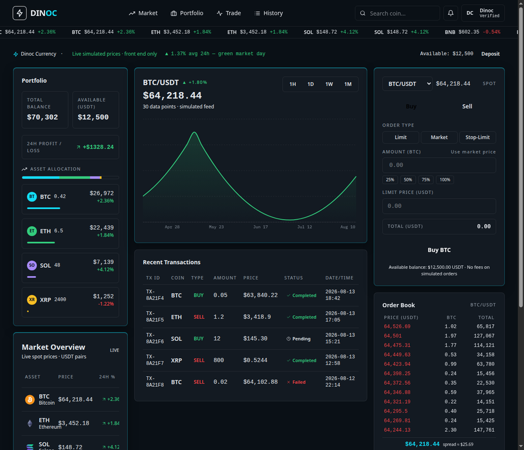

# Dinoc Currency — Crypto Exchange Dashboard

## Description
Dinoc Currency is a modern, responsive Cryptocurrency Exchange Dashboard UI built with **React + Vite + Tailwind CSS**. It implements a professional crypto trading interface similar to a real-world exchange platform, following a dark-themed "Midnight Precision Deck" design where data is the hero and color encodes price direction (green = up, red = down).

All data is **static/mock data only** (no backend or real API integration, per the project requirements), with a front-end tick simulator that makes prices **increase and decrease live every 1.5 seconds** with green/red flash indicators across the Market table, ticker tape, price chart, Order Book, and Portfolio.

## Technologies

- React.js (with hooks: `useState`, `useEffect`, `useCallback`, `useMemo`)
- Vite
- Tailwind CSS
- JavaScript (ES6+)
- React Icons
- Recharts (price chart)
- Sonner (toast notifications)

## Features

- **Dashboard / Header** — exchange logo, navigation (Market, Portfolio, Trade, History), cryptocurrency search with filtering, notifications, user profile dropdown, responsive mobile menu
- **Market Overview** — table with coin name, symbol, current price, 24h change, market cap and volume, plus live up/down flash indicators
- **Price Chart** — interactive area chart with 1H / 1D / 1W / 1M period toggles, current price readout and movement indicator
- **Trading Section** — pair selector, buy/sell tabs, amount and price inputs, 25/50/75/100% quick amounts, total calculation, Buy/Sell buttons, order type selector (Limit / Market / Stop-Limit)
- **Order Book** — buy/sell orders with price, amount and total around a live moving mid price
- **Recent Transactions** — transaction table with ID, coin, type, amount, price, status and date/time
- **Portfolio** — total balance, available balance, 24h profit/loss, asset allocation, holdings cards

## Installation

```bash
npm install
```

## Run

```bash
npm run dev
```

Then open http://localhost:5173

## Build

```bash
npm run build
npm run preview
```

## Deployment

Deploy the production build (`npm run build` → the `dist` folder) on **Netlify** or **Vercel**:

- **Netlify**: drag and drop the `dist` folder into the Netlify dashboard, or connect the GitHub repository.
- **Vercel**: `npx vercel` or import the GitHub repository in the Vercel dashboard (framework preset: Vite).

## Screenshots



## Project Structure

```
crypto-exchange-dashboard/
├── src/
│   ├── components/
│   │   ├── Header.jsx
│   │   ├── Logo.jsx
│   │   ├── IconButton.jsx
│   │   ├── MarketOverview.jsx
│   │   ├── PriceChart.jsx
│   │   ├── OrderBook.jsx
│   │   ├── TradePanel.jsx
│   │   ├── Portfolio.jsx
│   │   └── Transactions.jsx
│   ├── data/
│   │   └── mockData.js
│   ├── Home.jsx
│   ├── App.jsx
│   ├── main.jsx
│   └── index.css
├── index.html
├── vite.config.js
├── package.json
├── README.md
└── .gitignore
```
