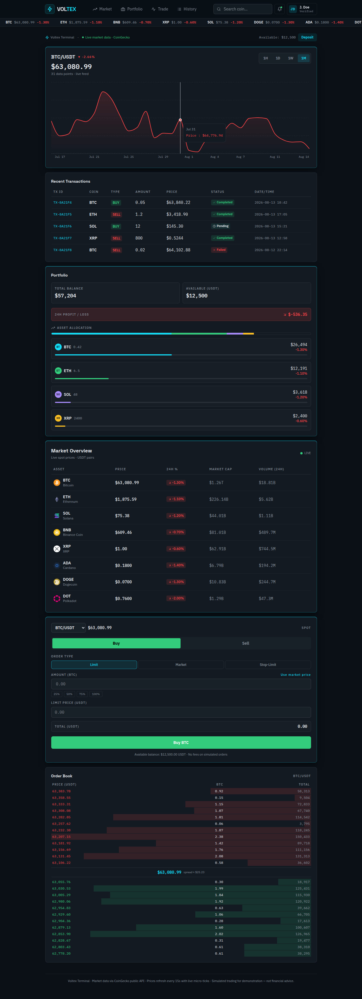
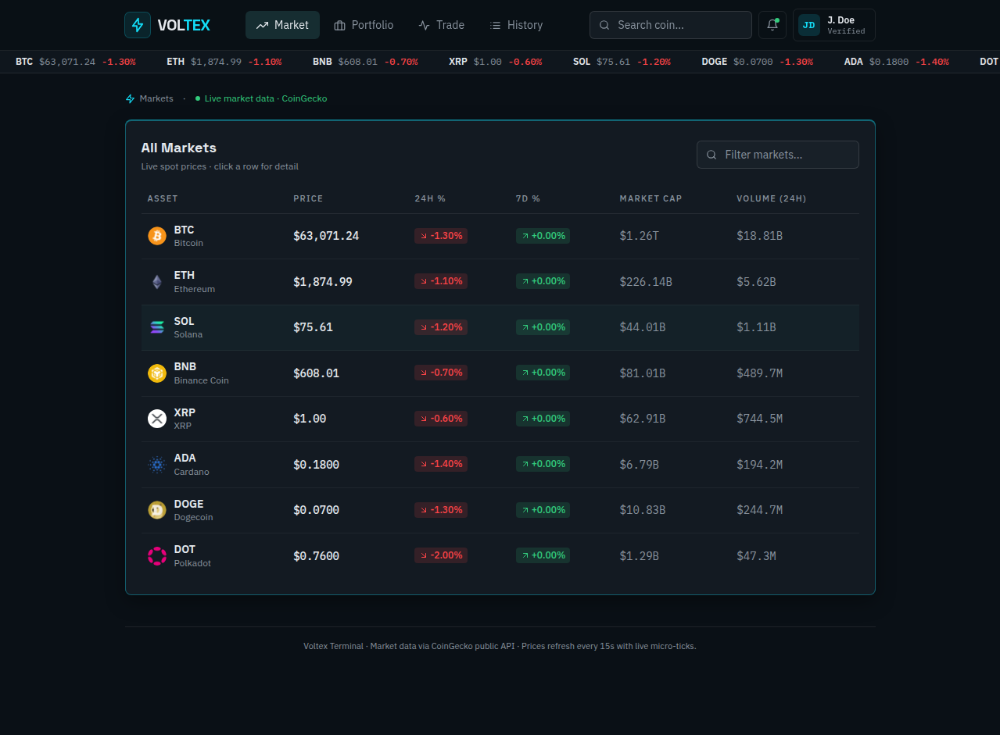
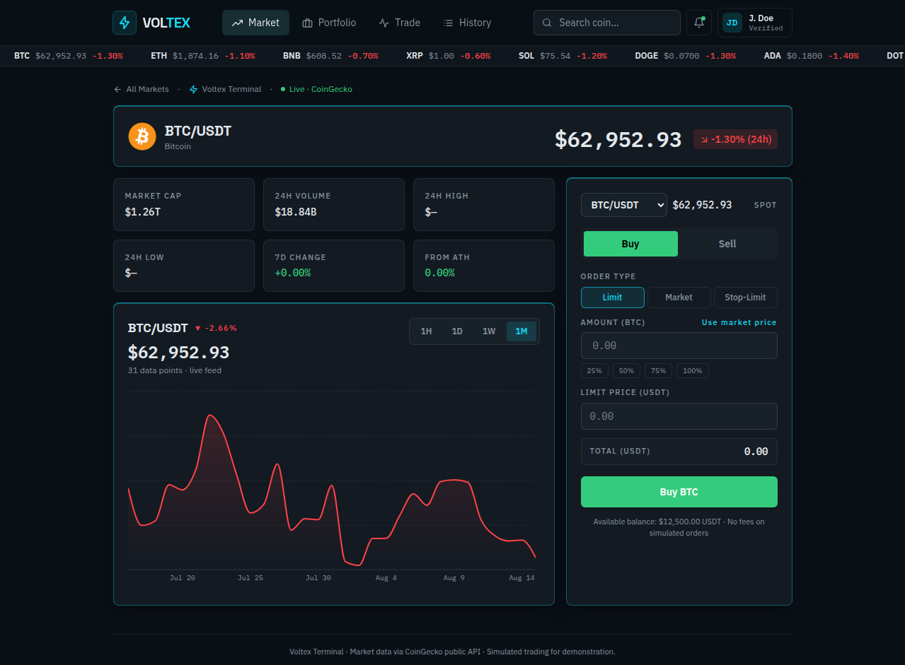
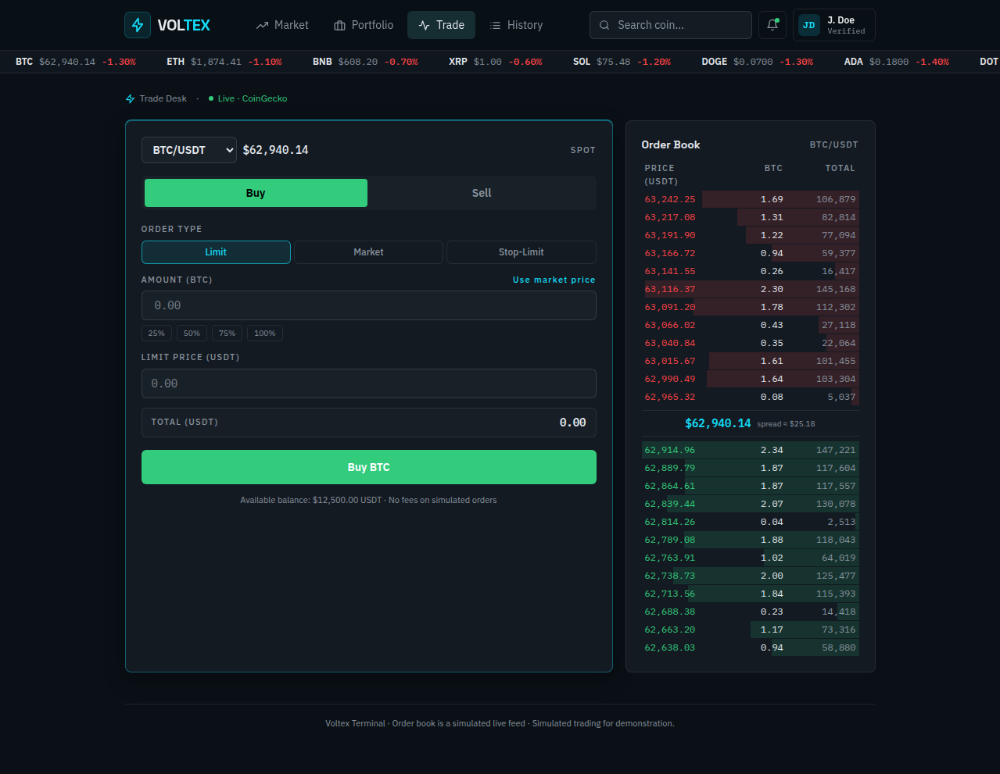
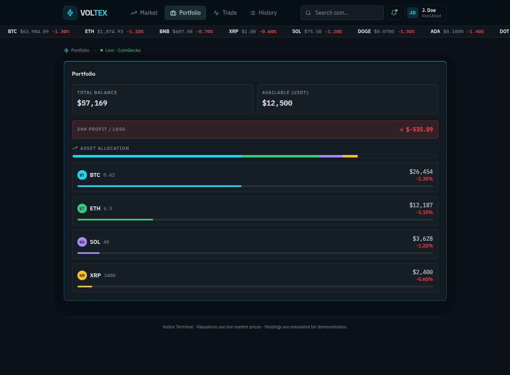
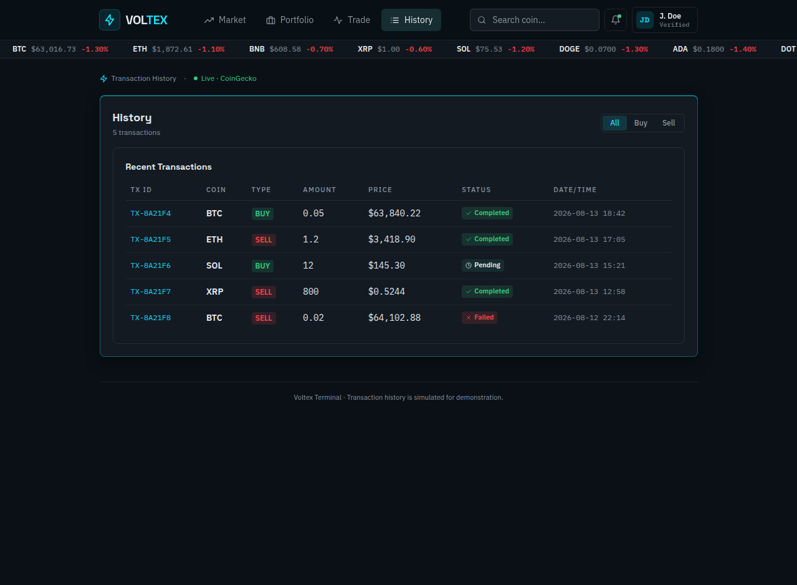

# Crypto Exchange Dashboard

## Description
Modern responsive cryptocurrency exchange dashboard built with React, Vite and Tailwind CSS. Live market prices refresh every 15 seconds from the CoinGecko public API with micro-tick flashes in between. Includes multi-page navigation (Dashboard, Markets, Market Detail, Trade, Portfolio, History, Profile), a simulated trading flow, live order book, price chart with real historical data, and a responsive mobile layout.

## Technologies

- React
- Vite
- Tailwind CSS
- JavaScript
- React Icons

## Features

- Market overview
- Crypto search
- Trading interface
- Buy/Sell functionality
- Price chart
- Order book
- Transactions
- Portfolio
- Deposit system
- Responsive mobile navigation

## Installation

```bash
npm install
```

## Run

```bash
npm run dev
```

## Build

```bash
npm run build
```

## Screenshots

**Dashboard** — live BTC/USDT chart, recent transactions, portfolio, market overview, trade panel and order book:



**Markets** — all markets with live spot prices, 24h/7d change, market cap and volume:



**Market Detail** — per-coin page with live price, stats, chart and quick trade:



**Trade** — dedicated trading desk with order types and simulated order book:



**Portfolio** — balance, 24h profit/loss and asset allocation:



**History** — filterable transaction history:



## Project Structure

```
crypto-exchange-dashboard/
├── src/
│   ├── components/
│   │   ├── Header.jsx
│   │   ├── Logo.jsx
│   │   ├── IconButton.jsx
│   │   ├── MarketOverview.jsx
│   │   ├── PriceChart.jsx
│   │   ├── OrderBook.jsx
│   │   ├── TradePanel.jsx
│   │   ├── Portfolio.jsx
│   │   └── Transactions.jsx
│   ├── data/
│   │   └── mockData.js
│   ├── App.jsx
│   ├── main.jsx
│   └── index.css
├── index.html
├── vite.config.js
├── package.json
├── README.md
└── .gitignore
```
